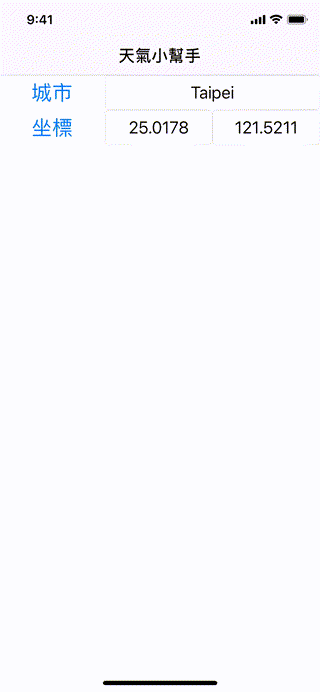

# WWWeatherHelper
[](https://developer.apple.com/swift/) [](https://developer.apple.com/swift/)  [](https://developer.apple.com/swift/) [](https://developer.apple.com/swift/)

### [Introduction - 簡介](https://swiftpackageindex.com/William-Weng)
- Use [OpenWeatherMap's API](https://openweathermap.org/) to obtain weather-related information for the city or the coordinates.
- 使用[OpenWeatherMap的API](https://openweathermap.org/)，取得該城市或該坐標的天氣相關資訊。



### [Installation with Swift Package Manager](https://medium.com/彼得潘的-swift-ios-app-開發問題解答集/使用-spm-安裝第三方套件-xcode-11-新功能-2c4ffcf85b4b)
```
dependencies: [
    .package(url: "https://github.com/William-Weng/WWWeatherHelper.git", .upToNextMajor(from: "1.0.5"))
]
```

### Function - 可用函式
|函式|功能|
|-|-|
|configure(appId:)|初始化設定|
|information(cityName:result:)|根據『城市名稱』取得氣候的相關數值|
|information(cityName:)|根據『城市名稱』取得氣候的相關數值|
|information(coordinate:result:)|根據『2D坐標』取得氣候的相關數值|
|information(coordinate:)|根據『2D坐標』取得氣候的相關數值|

### Example
```swift
final class ViewController: UIViewController {

    @IBOutlet weak var cityNameTextField: UITextField!
    @IBOutlet weak var latitudeTextField: UITextField!
    @IBOutlet weak var longitudeTextField: UITextField!
    @IBOutlet weak var resultTextView: UITextView!

    private let appId = "<appId>"
    
    override func viewDidLoad() {
        super.viewDidLoad()
        WWWeatherHelper.shared.configure(appId: appId)
    }
    
    @IBAction func weatherInformationForCity(_ sender: UIButton) { weatherInformationForCity() }
    @IBAction func infoForCoordinate(_ sender: UIButton) { weatherInformationForCoordinate2D() }
}

// MARK: - ViewController (private class function)
private extension ViewController {
    
    /// 取得該城市的天氣資訊
    func weatherInformationForCity() {
        
        view.endEditing(true)
        
        guard let cityName = cityNameTextField.text else { self.displayText(WWWeatherHelper.CustomError.unknown); return }
        
        WWWeatherHelper.shared.information(cityName: cityName) { result in
            switch result {
            case .failure(let error): self.displayText(error)
            case .success(let info): self.displayText(info.dictionary)
            }
        }
    }
    
    /// 取得該坐標的天氣資訊
    func weatherInformationForCoordinate2D() {
        
        view.endEditing(true)
        
        guard let latitudeText = latitudeTextField.text,
              let longitudeText = longitudeTextField.text,
              let latitude = Double(latitudeText),
              let longitude = Double(longitudeText),
              let coordinate2D = Optional.some(CLLocationCoordinate2D(latitude: latitude, longitude: longitude))
        else {
            self.displayText(WWWeatherHelper.CustomError.unknown); return
        }
        
        WWWeatherHelper.shared.information(coordinate: coordinate2D) { result in
            switch result {
            case .failure(let error): self.displayText(error)
            case .success(let info): self.displayText(info.dictionary)
            }
        }
    }
    
    /// 顯示文字
    /// - Parameter text: Any?
    func displayText(_ text: Any?) {
        
        guard let text = text else { return }
        DispatchQueue.main.async { self.resultTextView.text = "\(text)" }
    }
}
```
